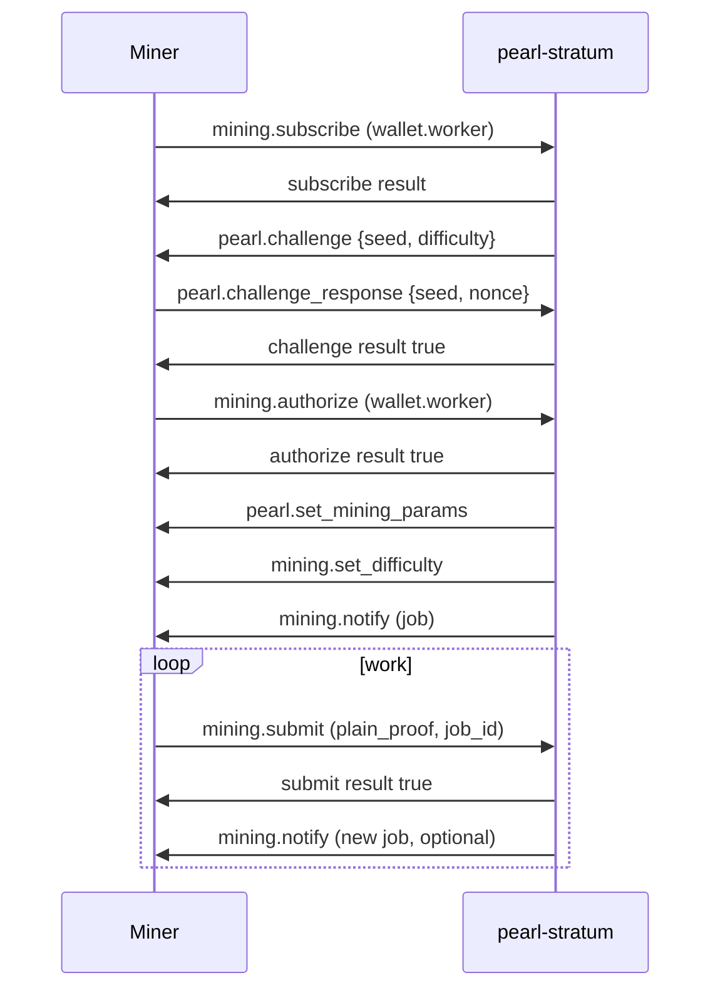

# Pearl (PRL) miner integration — Hashmonkeys pool

This document describes how to connect a **Pearl GPU miner** to the **Hashmonkeys DFPPS+ pool** over TCP. The wire format matches **alpha-miner 1.6+** / **AlphaPool v1.5+** Stratum extensions used by [pearl-research-labs/pearl](https://github.com/pearl-research-labs/pearl).

**Scope:** Hashmonkeys Pearl pool only (`eu-pearl-dfppsplus`). This is **not** Bitcoin-style Stratum on port 3333.

**Source:** Provided by Hashmonkeys pool operator (2026-05-19). DRQ copy for implementation reference.

---

## Quick reference

| Item | Value |
|------|--------|
| Pool id | `eu-pearl-dfppsplus` |
| Stratum host | `eu.hashmonkeys.cloud` |
| Stratum port | **12437** (plain TCP, no TLS) |
| Miner URL | `stratum+tcp://eu.hashmonkeys.cloud:12437` |
| Login (worker id) | `prl1…<taproot-address>.<workerName>` |
| Password | `x` or empty; optional static diff: `d=50000` |
| Coin | Pearl (PRL) — Proof-of-Useful-Work (ZK matrix multiply on GPU) |
| Reference miner | `alphaminetech/pearl-miner:1.6.0` or newer |
| Pool API | `https://hashmonkeys.cloud/api/pools/eu-pearl-dfppsplus` |
| Miner stats API | `https://hashmonkeys.cloud/api/pools/eu-pearl-dfppsplus/miners/<wallet>` |
| Pool fee | 0.5% |
| Minimum payout | 0.5 PRL |

**SOLO mining** (your own `prl1` address, 0% pool fee) requires running a local `pearl-gateway` + vLLM miner per the [Pearl upstream docs](https://github.com/pearl-research-labs/pearl). Contact the pool operator for synced-node RPC access if needed. This doc covers **pooled DFPPS+ on :12437** only.

---

## Architecture (what you are talking to)

```
Your miner  --TCP JSON-RPC lines-->  pearl-stratum (:12437)
                                         |
                                         +-- pearl.challenge / mining.notify / …
                                         |
                                         v
                                    pearl-gateway (internal)
                                         |
                                         v
                                      pearld (Pearl full node)
```

- **pearl-stratum** is a thin bridge: Stratum on the outside, `getMiningInfo` / `submitPlainProof` JSON-RPC to **pearl-gateway** on the inside.
- Shares are credited by **pearl-accounting** (DFPPS+). Blocks pay the pool Taproot address first; balances are credited after **100 confirmations**, payouts queued at **0.5 PRL** minimum.
- The pool **acknowledges `mining.submit` immediately** when a valid `plain_proof` is present (alpha-miner pre-validates). Gateway block submission runs asynchronously.

---

## Transport

- **Protocol:** newline-delimited **JSON-RPC 2.0** messages (`\n` terminated).
- **Direction:** full duplex; the server pushes notifications (`method` set, `id: null`) at any time.
- **Encoding:** UTF-8 JSON.
- **TLS:** not used on port 12437.

Each line is one JSON object. Example client request:

```json
{"id":1,"method":"mining.subscribe","params":["prl1YOUR_WALLET_ADDRESS.MyRig","x"]}
```

Example server notification:

```json
{"jsonrpc":"2.0","id":null,"method":"pearl.challenge","params":{"seed":"752b1154…","difficulty":32}}
```

---

## Connection lifecycle



### Handshake rules

1. **`pearl.challenge` must succeed** before jobs are issued. Until `challengePassed`, the server will not send `pearl.set_mining_params` or `mining.notify`.
2. **`mining.subscribe` and `mining.authorize`** may arrive in either order; both are required. Either step can trigger (or re-send) `pearl.challenge`.
3. Optional but recommended: **`mining.configure`** and **`mining.extranonce.subscribe`** (alpha-miner sends these; server replies with extension flags).

---

## Client → server methods

### `mining.subscribe`

**Params:** `[workerId, password]`

- `workerId`: `prl1…address.WorkerName` (dot separates wallet and worker; if no dot, worker defaults to `default`).
- `password`: ignored except for static difficulty (see below).

**Response:**

```json
[[["mining.set_difficulty","conn-12345678"],["mining.notify","conn-12345678"]],"",0]
```

After subscribe, expect **`pearl.challenge`** as an server-initiated message (not a reply to your id).

---

### `pearl.challenge_response` (or `pearl.response`)

Sent **after** receiving `pearl.challenge`.

**Params (object form):**

```json
{"seed":"<64-char-hex>","nonce":"<decimal-or-hex-nonce>"}
```

**Params (array form):** `["<seed-hex>", "<nonce>"]`

**Response:** `{"id":…,"result":true,"error":null}` on success.

**Failure:** `result: false`, `error: {"code":23,"message":"Invalid challenge"}` — connection is closed.

#### Challenge algorithm

- Server sends `seed` (32 bytes, 64 hex chars) and `difficulty` (leading-zero **bits**, typically **32**).
- Client searches for a `nonce` such that **BLAKE3** of `seed || nonce` (or equivalent byte order — see below) meets the difficulty target.
- Target: `2^(256 - difficulty)` compared against the hash interpreted as big-endian or little-endian integer, **or** at least `difficulty` leading zero bits (MSB-first).

The pool accepts any of these BLAKE3 input layouts (matches AlphaPool / alpha-miner variants):

| Layout |
|--------|
| `BLAKE3(seed ‖ nonce_u32_le)` |
| `BLAKE3(seed ‖ nonce_u32_be)` |
| `BLAKE3(nonce_u32_le ‖ seed)` |
| `BLAKE3(nonce_u32_be ‖ seed)` |
| `BLAKE3(seed ‖ nonce_u64_le)` |
| `BLAKE3(seed ‖ nonce_u64_be)` |
| `BLAKE3(nonce_u64_le ‖ seed)` |
| `BLAKE3(nonce_u64_be ‖ seed)` |

`nonce` may be sent as a **decimal string** or **hex string** (up to 16 hex digits).

Implementations should match alpha-miner / AlphaPool challenge behavior (BLAKE3 over seed + nonce variants).

---

### `mining.authorize`

**Params:** `[workerId, password]`

Same wallet/worker parsing as subscribe.

**Response:** `{"id":2,"result":true,"error":null}`

If challenge was not yet passed, server sends (or re-sends) `pearl.challenge`.

---

### `mining.configure` (optional)

**Params:** extension list, e.g. `[["pearl/v1",{}]]`

**Response:**

```json
{"pearl/v1":true,"pearl/v1.share_format":"base64"}
```

---

### `mining.extranonce.subscribe` (optional)

**Response:** `true`

Pearl jobs do not use extranonce; this exists for alpha-miner compatibility.

---

### `mining.submit`

Submit a pool-difficulty **plain proof** for the current or a recent job.

**Accepted param shapes:**

Object:

```json
{
  "plain_proof": "<base64-or-similar proof string>",
  "job_id": "0000fae9-310a0ffc0daf5876"
}
```

Array (alpha-miner style):

```json
["prl1….WorkerName", "0000fae9-310a0ffc0daf5876", "<plain_proof>"]
```

Other accepted array layouts: `[job_id, plain_proof]` or `[plain_proof]` when job id is omitted (server uses active/recent job).

**Job id format:** `^[0-9a-f]{8}-[0-9a-f]{16}$` (8-hex seq + hyphen + 16-hex header digest prefix).

**Plain proof:** non-empty string, length ≥ 32, characters `[A-Za-z0-9+/=_-]+` (base64-family).

**Responses:**

| Condition | Result |
|-----------|--------|
| Valid proof, known job | `result: true` (immediate) |
| Challenge not passed / no wallet | `false`, code **21** "Not authorized" |
| Missing proof | `false`, code **20** "Missing plain_proof" |
| Unknown/stale job | `false`, code **21** "Unknown or stale job" |

The miner must produce `plain_proof` from the **`headerHex`** in `mining.notify` using the matrix parameters from **`pearl.set_mining_params`**. Upstream Pearl / alpha-miner documentation covers GPU proof generation.

---

## Server → client notifications

All use `"id": null` and include `"jsonrpc":"2.0"` when sent by Hashmonkeys pearl-stratum.

### `pearl.set_mining_params`

Sent once handshake completes. **Your miner must use these dimensions** (mainnet pool values):

```json
{
  "method": "pearl.set_mining_params",
  "params": [{
    "m": 131072,
    "n": 131072,
    "k": 4096,
    "rank": 128,
    "rows_pattern": [0, 32],
    "cols_pattern": [0, 1, 2, …, 63],
    "mma_type": "Int7xInt7ToInt32"
  }]
}
```

`rows_pattern` / `cols_pattern` are derived from `m`, `h`, and `w` on the server (`rowStride = floor(m / h / 2048)`). Do not hard-code stale 4096³ values from older docs.

---

### `mining.set_difficulty`

**Params:** `[difficulty]` — pool share difficulty (integer). Starting difficulty is typically **10000**; variable difficulty retargets based on submit rate.

**Static difficulty:** set password to `d=<number>` on subscribe/authorize, e.g. `d=50000`.

---

### `mining.notify`

Alpha-miner / AlphaPool **7-element array**:

```json
[
  "<jobId>",
  "<prevBlockHashHex>",
  "<headerHex>",
  <shareNbits>,
  "<timestampHex>",
  "<poolCompactHex>",
  <cleanJobsBoolean>
]
```

| Index | Field | Meaning |
|-------|--------|---------|
| 0 | jobId | `{8-hex-seq}-{16-hex-sha256-prefix}` |
| 1 | prevBlockHashHex | Bytes 4–35 of header, reversed (display order) |
| 2 | headerHex | Full incomplete block header (hex); mine against this |
| 3 | shareNbits | Parsed from first 8 hex chars of jobId |
| 4 | timestampHex | 4-byte LE timestamp from header offset 68 |
| 5 | poolCompactHex | Pool difficulty as compact target (8 hex chars) |
| 6 | cleanJobs | `true` = discard previous jobs |

**Example (from live AlphaPool capture):**

```json
{
  "method": "mining.notify",
  "params": [
    "0000fae9-310a0ffc0daf5876",
    "eace015d79530dc84a1caea816370536e059c7100d99fdd894a2cb3a9aa00b19",
    "00004020190ba09a3acba294d8fd990d10c759e036053716a8ae1c4ac80d53795d01ceeaeb51b7e7955bf2f89093b3fe5fbc39f2fba06993a6d4c428ba57c2a21327c9293fc01a6ab2d10118",
    64233,
    "6a1ac03f",
    "1b014f8a",
    true
  ]
}
```

On new chain tips, job id and header change; server sets `cleanJobs: true`.

---

## Wallet and worker naming

| Input | Parsed wallet | Parsed worker |
|-------|----------------|---------------|
| `prl1abc…xyz.rig1` | `prl1abc…xyz` | `rig1` |
| `prl1abc…xyz` | `prl1abc…xyz` | `default` |

- Addresses are **Pearl Taproot** (`prl1…`).
- Worker name is cosmetic for stats; payouts go to the wallet portion.
- Dashboard: `https://hashmonkeys.cloud/dashboard.html?wallet=prl1…`

---

## Testing connectivity

### Port check

```bash
# Linux
timeout 8 bash -c 'echo > /dev/tcp/eu.hashmonkeys.cloud/12437' && echo OPEN || echo CLOSED

# Windows PowerShell
Test-NetConnection eu.hashmonkeys.cloud -Port 12437
```

Expected: **OPEN** (resolves to Hashmonkeys EU front-end).

### Minimal handshake probe

```bash
nc eu.hashmonkeys.cloud 12437
```

Paste (one line):

```json
{"id":1,"method":"mining.subscribe","params":["prl1YOUR_WALLET_ADDRESS.test","x"]}
```

You should receive JSON lines including `pearl.challenge`. Without a valid GPU proof you cannot complete mining, but this confirms the Stratum bridge is reachable.

---

## Implementing your own miner or dev-fee proxy

If you run a **separate** stratum endpoint (e.g. your own hostname on port 3333), that service must implement **this same protocol** (including `pearl.challenge` and Pearl-specific notify/submit fields). Hashmonkeys does **not** expose port 3333 for Pearl.

Typical approaches:

1. **Fork / embed alpha-miner 1.6+** and point `-o stratum+tcp://eu.hashmonkeys.cloud:12437 -u prl1….worker`.
2. **Stratum proxy** that speaks Pearl on the miner side and forwards to `:12437` on the pool side (preserve job ids and plain proofs verbatim).
3. **Full custom miner:** implement handshake + GPU PoUW from [pearl-research-labs/pearl](https://github.com/pearl-research-labs/pearl) (`miner/pearl-gateway/README.md`, vLLM miner).

For dev fees, split at the **client** (two pool connections) or in a **proxy** that rewrites the wallet in `mining.subscribe` / `mining.authorize` for the fee portion — do not expect classic `3333` BTC stratum.

---

## HTTP API (stats, not mining)

| Endpoint | Purpose |
|----------|---------|
| `GET /api/pools` | Pool list (includes `eu-pearl-dfppsplus`) |
| `GET /api/pools/eu-pearl-dfppsplus` | Pool hashrate, miners, network stats |
| `GET /api/pools/eu-pearl-dfppsplus/miners/{wallet}` | Worker hashrate, pending shares |
| `GET /api/pools/eu-pearl-dfppsplus/payments?address={wallet}` | Payout history |

Base URL: `https://hashmonkeys.cloud/api/…`

---

## Troubleshooting

| Symptom | Likely cause |
|---------|----------------|
| TCP timeout on `:3333` | Wrong port; Hashmonkeys Pearl uses **`:12437`** |
| Immediate disconnect after subscribe | Failed or missing `pearl.challenge_response` |
| `Invalid challenge` | Wrong BLAKE3 layout or nonce encoding |
| `Missing plain_proof` | Submit params not in expected shape |
| `Unknown or stale job` | Job id from old `mining.notify`; use latest job after `cleanJobs: true` |
| Shares accepted, no blocks | Normal at pool difficulty; blocks are rare and require gateway `accepted` |
| Hash A mismatch (share rejected server-side) | Header in notify does not match proof; ensure alpha-miner **1.6+** and correct `pearl.set_mining_params` |

---

## References

- Pearl upstream: https://github.com/pearl-research-labs/pearl  
- Reference miner image: `alphaminetech/pearl-miner:1.6.0`  
- Pool website / API: https://hashmonkeys.cloud

---

## Document history

| Date | Notes |
|------|--------|
| 2026-05-19 | Initial public integration doc for third-party miner authors (Hashmonkeys `eu-pearl-dfppsplus`, port **12437**). |
| 2026-06-02 | Copied into DRQ repo (`doc/PEARL_HASHMONKEYS_INTEGRATION.md`) from pool operator. |
