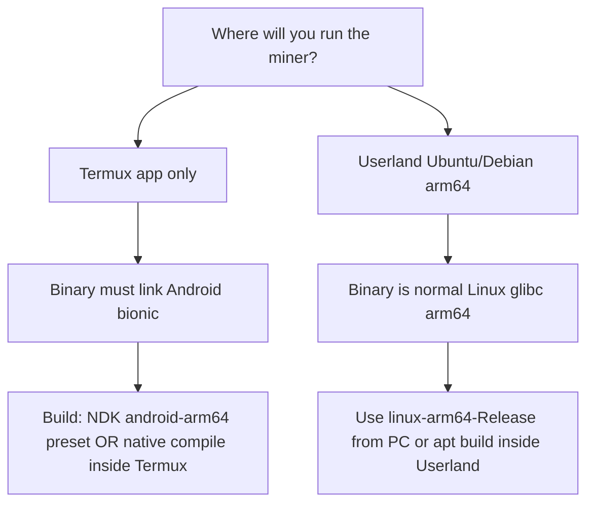

# Termux and Userland (Android phones)

DRQ Miner on a phone is **experimental**. Verus **CPU** is the reliable path; **GPU (OpenCL)** depends on the OEM and often does not work in Termux/Userland without vendor libraries.

**DERO (AstroBWT v3) on phone CPU** is supported via the **portable** hash path (divsufsort — no Wolf/SPSA). It is **much slower** than desktop but must produce **valid shares**. Rabid requires **`--daemon`** and **`wss://`**. See `scripts/android/mine_dero_userland.sh`.

---

## Pick your environment first



| Environment | libc | Binary to use | Build where |
|-------------|------|---------------|-------------|
| **Termux** (no Userland) | Bionic (Android) | `drqminer` from **NDK** `android-arm64-Release`, or **native Termux build** | PC cross-compile, or `scripts/android/build_termux.sh` on device |
| **Userland** (Ubuntu/Debian arm64) | glibc | `drqminer` from **`linux-arm64-Release`** | PC/WSL cross-compile, or `apt` + cmake inside Userland |
| **Do not mix** | — | Linux arm64 binary **fails** in Termux (`linker` error) | — |

You said you use **Userland** — default to the **Userland / linux-arm64** path unless you specifically want Termux-only.

---

## Recommended: Userland (Ubuntu arm64)

### DERO on Userland (CPU)

After `drqminer` is built with AstroBWT (default in `build_userland.sh`):

```bash
export WALLET=dero1qYOUR_ADDRESS
bash scripts/android/mine_dero_userland.sh
# or:
./drqminer --daemon -a astrobwt/v3 -o wss://dero.rabidmining.com:10300 -u "$WALLET" -p x -t 4
```

Run `./test_astrobwt` in the build dir first if you want to confirm **6/6** vectors before mining.

### Phase 1 — Run a prebuilt (fastest)

On your PC (WSL or Linux):

```bash
bash scripts/android/build_userland.sh
# or full preset:
cmake --preset linux-arm64-Release && cmake --build out/build/linux-arm64-Release -j$(nproc)
```

Copy to the phone (USB, `scp`, or shared folder Userland mounts):

- `out/build/linux-arm64-Release/drqminer`
- `src/backend/opencl/cl/verus/verushash.cl` (same folder as `drqminer` if you try OpenCL)

Inside **Userland Ubuntu** (arm64):

```bash
chmod +x drqminer
./drqminer -V
./drqminer -a verus -o stratum+tcp://POOL:PORT -u WALLET -p x -t 4
```

Use **4 threads or fewer** on a phone unless you have a reason and cooling.

### Phase 2 — Build inside Userland (no PC)

```bash
sudo apt update
sudo apt install -y git cmake build-essential libssl-dev
git clone <your-drq-repo-url> drqminer-src && cd drqminer-src
cmake --preset linux-arm64-Release
cmake --build out/build/linux-arm64-Release -j$(nproc)
cp src/backend/opencl/cl/verus/verushash.cl out/build/linux-arm64-Release/
./out/build/linux-arm64-Release/drqminer -a verus -o stratum+tcp://POOL:PORT -u WALLET -p x -t 4
```

### Phase 3 — GPU in Userland (optional)

1. Install OpenCL ICD if your distro exposes it (often **not** on phone images):
   ```bash
   sudo apt install -y clinfo ocl-icd-opencl-dev   # if packages exist for your image
   clinfo
   ```
2. If `clinfo` lists a GPU, try:
   ```bash
   ./drqminer --no-cpu --opencl -a verus -o stratum+tcp://POOL:PORT -u WALLET -p x
   ```
3. If no platforms/devices → stay on **CPU**.

Intensity is capped automatically for low global memory (see `OclVerusHashRunner::verusIntensityForDevice`).

---

## Termux-only (bionic)

### Option A — Push NDK binary from PC

```bash
# On PC
cmake --preset android-arm64-Release
cmake --build out/build/android-arm64-Release
adb push out/build/android-arm64-Release/drqminer /data/data/com.termux/files/home/drqminer
adb push src/backend/opencl/cl/verus/verushash.cl /data/data/com.termux/files/home/
```

In Termux:

```bash
chmod +x ~/drqminer
~/drqminer -a verus -o stratum+tcp://POOL:PORT -u WALLET -p x -t 4
```

Or use `scripts/android/push_to_termux.sh` from the repo on PC.

### Option B — Native build in Termux (no NDK on PC)

```bash
pkg update
pkg install -y git cmake clang make openssl libuv
cd ~
git clone <repo> drqminer-src && cd drqminer-src
bash scripts/android/build_termux.sh
```

Run:

```bash
bash scripts/android/mine_vrsc_termux.sh
# or edit POOL/WALLET inside the script first
```

### Termux + storage

Allow Termux storage or keep the miner under `~/` so `verushash.cl` stays next to the binary.

```bash
termux-setup-storage   # optional, for configs on SD card
```

---

## Mining config (phone-friendly)

Minimal `config.json` in the same directory as `drqminer`:

```json
{
  "api": { "id": null, "worker-id": null },
  "autosave": true,
  "cpu": { "enabled": true, "huge-pages": false, "priority": 0, "max-threads-hint": 4 },
  "opencl": { "enabled": false },
  "cuda": { "enabled": false },
  "pools": [
    {
      "url": "stratum+tcp://POOL:PORT",
      "user": "WALLET",
      "pass": "x",
      "algo": "verus",
      "keepalive": true,
      "tls": false
    }
  ]
}
```

Enable OpenCL only after `clinfo` / miner device list shows a GPU:

```json
"cpu": { "enabled": false },
"opencl": { "enabled": true }
```

Template on disk: `scripts/android/config.verus.phone.json.example`.

---

## Operational checklist (phones)

| Item | Guidance |
|------|----------|
| Threads | Start `-t 2` or `-t 4`; raise only if thermals stay safe |
| Power | Plug in; disable battery saver for long runs |
| Background | Termux: `termux-wake-lock` while mining; Userland: keep session alive (tmux/screen) |
| Pool | Prefer low-latency stratum; test with `--dry-run` or short run first |
| Updates | Re-copy `drqminer` + `verushash.cl` together after upgrades |
| Legal / carrier | You are responsible for device ToS and power use |

Termux wake lock (while session runs):

```bash
pkg install termux-api
termux-wake-lock
./drqminer ... 
# termux-wake-unlock when done
```

---

## Roadmap (DRQ Miner repo)

Planned work centered on Termux/Userland (not a Play Store app yet):

| Step | Deliverable | Status |
|------|-------------|--------|
| 1 | This doc + `scripts/android/*` helpers | **Now** |
| 2 | CI / release artifact `drqminer-linux-arm64` + `drqminer-android-arm64` | Backlog |
| 3 | Slim Android/Termux build (`-DWITH_RANDOMX=OFF` etc.) for smaller binary | Backlog |
| 4 | Published checksums + one-line Termux install from Releases | Backlog |
| 5 | Phone soak tests (CPU Verus shares on Userland + Termux) | Backlog |
| 6 | OpenCL on Adreno — document pass/fail per device; no promise | Research |

---

## Troubleshooting

| Symptom | Fix |
|---------|-----|
| `No such file or directory` running binary in Termux | You used **linux-arm64** build; use **android-arm64** or Termux native build |
| `error while loading shared libraries: libc.so` in Userland | You used **android-arm64** build; use **linux-arm64** |
| `verushash.cl` not found | Copy CL file next to `drqminer` |
| Miner starts then killed | Thermal / OEM; lower `-t`, use wake lock, plug in |
| OpenCL 0 devices | Normal on many phones; use CPU |
| Very low hashrate | Expected on phone CPUs vs desktop |

---

## Related docs

- [LEGACY_GPU_AND_ANDROID.md](LEGACY_GPU_AND_ANDROID.md) — NDK preset, K2 GPUs
- [build/CMAKE_OPTIONS.md](build/CMAKE_OPTIONS.md) — presets table
- [PHASE2_BACKLOG.md](PHASE2_BACKLOG.md) — release artifacts + mobile items
